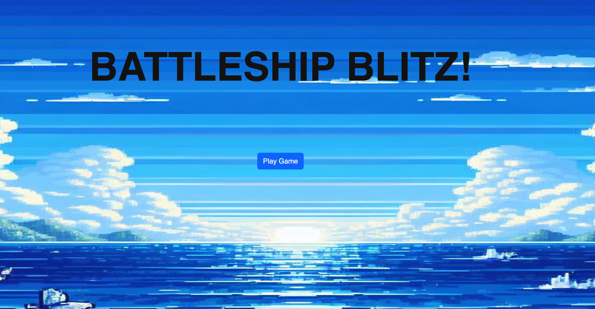
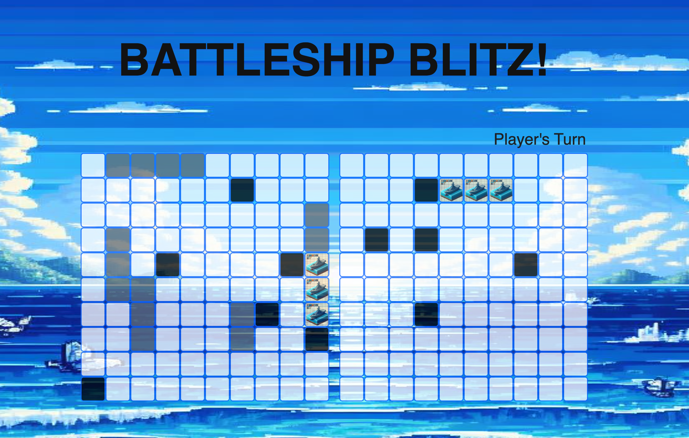
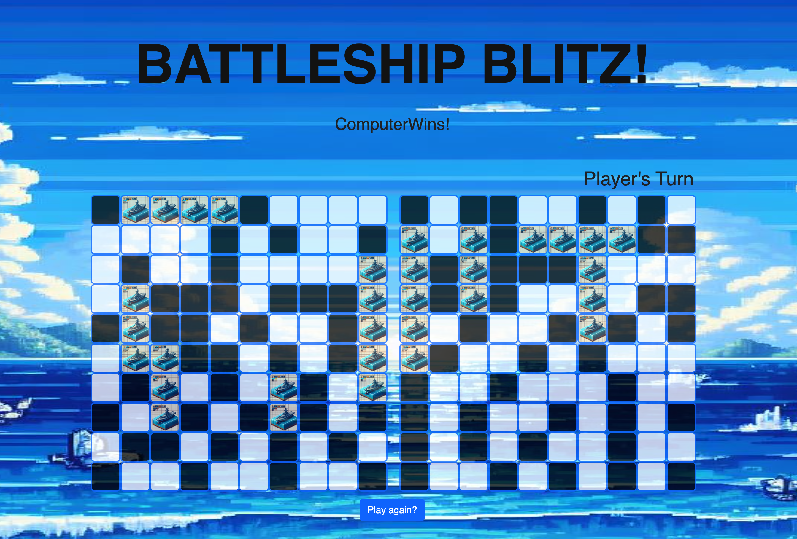

# BattleShip Blitz

## Description

Battleship Blitz game is an online game where players engage in classic naval warfare against a computer opponent. Both Players fleets are randomly placed at the start of each games. Each turn, players can select an empty cell to attack, aiming to sink their opponent's ships before their own fleet suffers the same fate. With varying ship sizes and challenging AI, "Battleship Blitz" offers an immersive and competitive gaming experience for naval enthusiasts.
This project was part of our first project assignment through General Assembly bootcamp. The project was developed using JavaScript, CSS, HTML and some Bootstrap for better user experience.

## Table of contents

- [Description](#description)
- [Installation](#installation)
- [Usage](#usage)
- [Credits](#credits)
- [License](#license)
- [Contributions](#contributions)
- [Future Enhancements](#future-enhancements)
- [Questions](#questions)

## Installation

N/A

## Usage

1 - Acces the website  
2 - Press the Play Game button  
3 - Start Playing.  
4 - If it's players turn, just "click" on the choosen location of preference.

## Credits

Tatiana Bertazoli

## License

N/A

## Contributions

N/A

## Future Enhancements

1 - Add a drag and drop feature for the user to be able to strategically place the ship

## Questions

For questions please contact https://github.com/tbertazoli

GitHub repository link: https://github.com/TBertazoli/battleship-game

GitHub deployed link: https://tbertazoli.github.io/battleship-game/

email: tatianabertazoli@gmail.com
